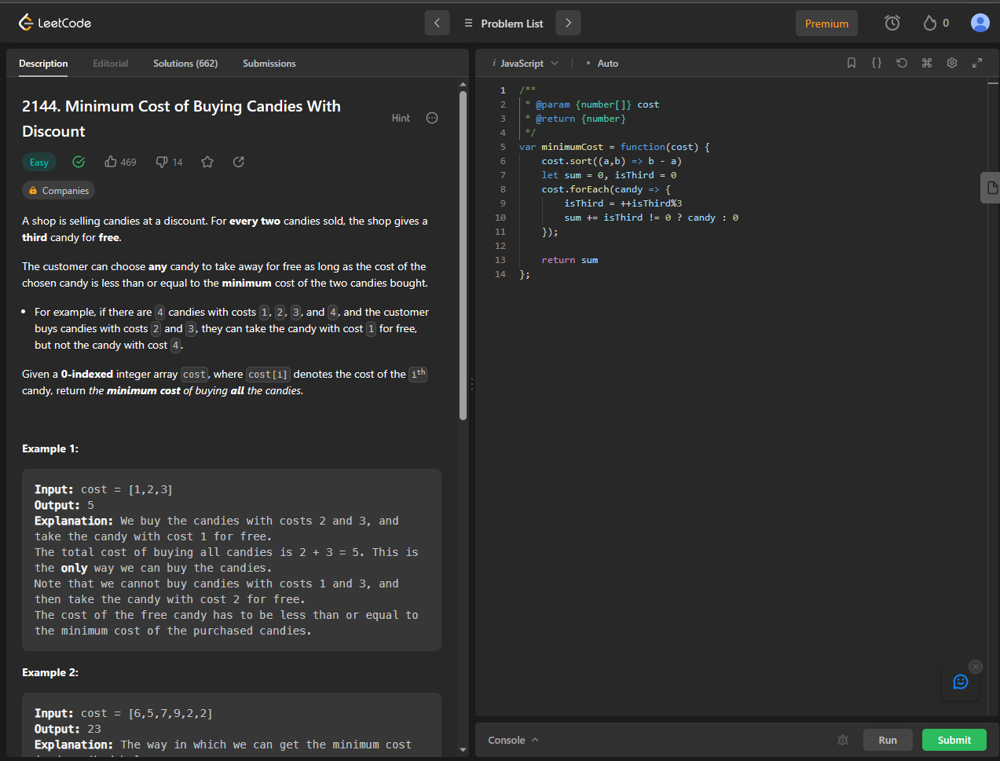
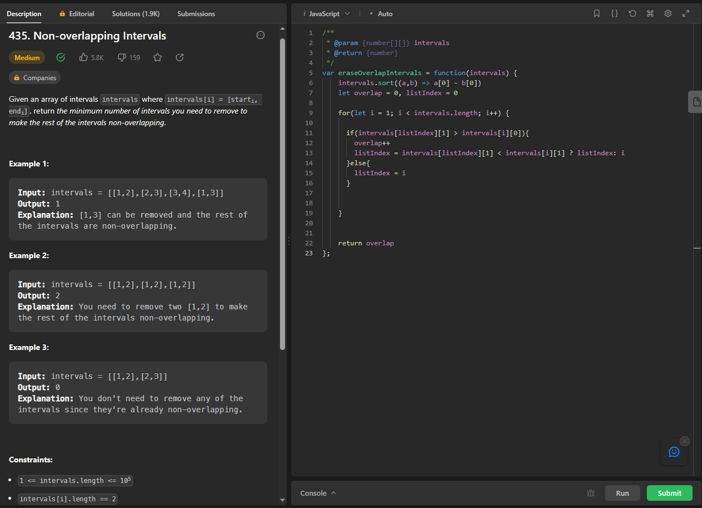
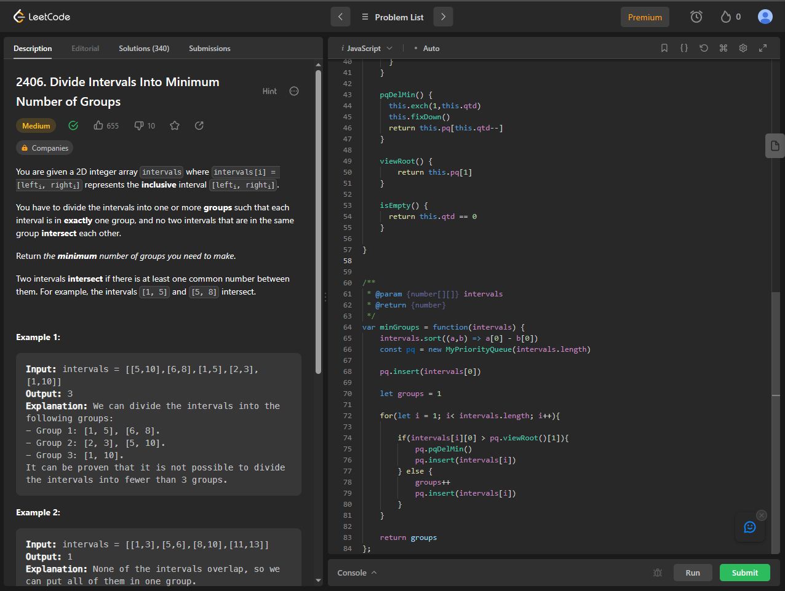
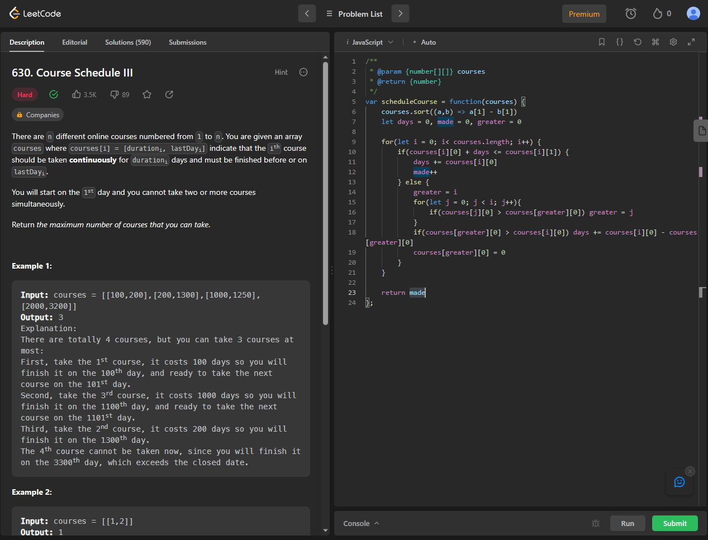

# Exercicios Greed - LeetCode

**Número da Lista**: 3 
**Conteúdo da Disciplina**: Greed  

## Alunos
|Matrícula | Aluno |
| -- | -- |
| 20/0028677  |  Vitor Manoel Aquino de Brito |

## Sobre 
Este repositório contém a resolução de 4 exercicios relacionados a Algoritmos Ambiciosos, contemplando os algoritmos de Interval scheduling, o algoritmo de Interval Partitioning (com fila de prioridade) e scheduling to minimize lateness adaptado. Os Exercicios realizados foram retirados do [LeetCode](https://leetcode.com/)

## [Link da Apresentação]()

## Screenshots

### Exercicio 1 - Minimum Cost of Buying Candies With Discount

Link: [Non-Overlapping](https://leetcode.com/problems/non-overlapping-intervals/description/)  
Dificuldade: Fácil

### Exercício 2 - Non-Overlapping

Link: [Non-Overlapping](https://leetcode.com/problems/non-overlapping-intervals/description/) 
Dificuldade: Médio

### Exercicio 3 - Divide Intervals Into Minimum Number of Groups

Link: [Divide Intervals Into Minimum Number of Groups](https://leetcode.com/problems/divide-intervals-into-minimum-number-of-groups/description/)  
Dificuldade: Médio

### Exercício 4 - Course Schedule III

Link: [Course Schedule III](https://leetcode.com/problems/course-schedule-iii/description/)  
Dificuldade: Difícil

## Instalação 
**Linguagem**: JavaScript 

Caso queira testar localmente é necessário ter o nodeJS instalado

## Uso 

Para verificar o funcionamento basta abrir o link do exercicio e copiar o código referente a questão, e logo após realizar o envio (caso esteja o console.log no final, basta trocá-lo pelo return seguido da variável). Caso queira verificar localmente, é necessário executar o programa, e para isto basta utilizar o comando:

`node NomeDoArquivo.js`.

